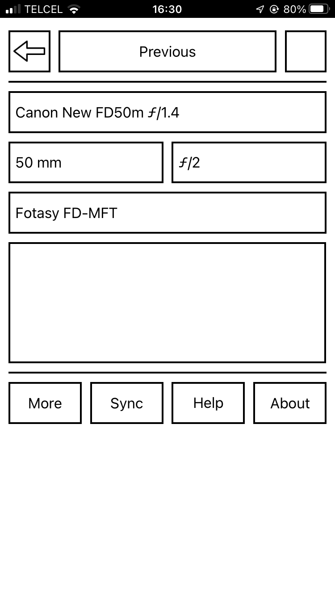

# Lens Slate: Home

[Lens Slate](index.html) is a free photography app for iOS and Android to help you keep track of the configuration of manual lenses as you shoot.

* [News](news.html)
* [Manual](manual.html)
* [FAQ](faq.html)
* Support Email: [lensslate@gmail.com](mailto:lensslate@gmail.com).

## What is it for?

When you use a _digital_ lens on a digital camera body, information about the lens model, focal length, and focal ratio is typically  recorded in the image file. 

When you use a _manual_ lens, this information is not recorded. Later, you might remember which manual lens you used for a particular photograph, but you often won't remember the focal ratio or, for zooms, the focal length. 

Lens Slate helps you keep track of this information.

## How do you install it?

Open [the app web page](app.html) in 

* Safari on your iOS device or
* Chrome on your Android device

and follow the instructions.

## How does it work?

On the main screen of the app you select the lens model, focal length, focal ratio, adapter model, and whether the configuration applies to the previous images or the next images. 

You end up with a screen that looks something like this:

  
 
After setting the configuration, you take a
screenshot:

* On iOS, you press the Home and Sleep/Wake buttons simultaneously.
* On Android, you press and hold the Volume Down and Power buttons simultaneously.

The screenshot will be saved in the camera roll on your device.

After shooting, you import the photos from your camera and
the screenshots from your iOS device into your catalog software (Lightroom,
Photos, or similar). 

If you sort by capture time, the
configuration screenshots will be interspersed with your photos:

  

You can now match the lens configuration to your photos.

If you want to take this a step further, you can then add the lens configuration to your photos using, for
example, [exiftool](http://owl.phy.queensu.ca/~phil/exiftool/) or the [Lens Tagger plugin](http://www.essl.de/wp/software/lenstagger-lightroom-plugin/) for Lightroom.

© 2016, 2018 [Alan WF](https://alanwf.com/)
