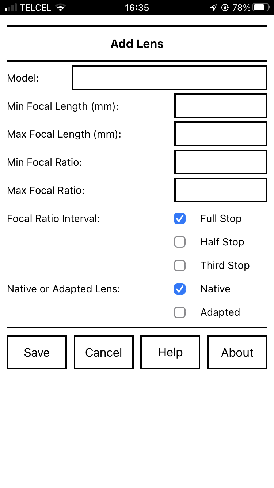
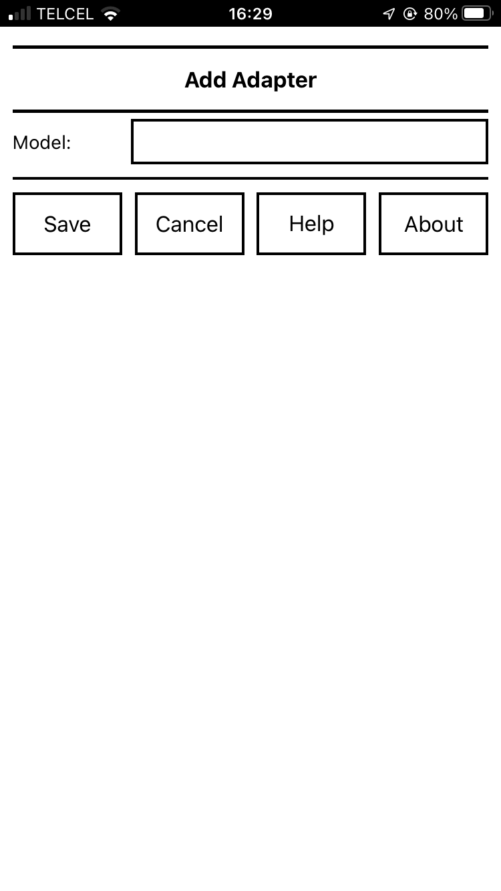

# Lens Slate: Manual

_2020 September 3_

[Lens Slate](index.html) is a free photography app for iOS and Android to help you keep track of the configuration of manual lenses as you shoot.

* [Introduction](#introduction)
* [Before Shooting: Installing the App](#installing)
* [Before Shooting: Adding Lenses and Adapters](#adding)
* [Before Shooting: Synchronizing Clocks](#sychronizing)
* [While Shooting](#while)
* [After Shooting](#after)
* [Support](#support)
* [License](#license)
* [Credits](#credits)

Copyright © 2016, 2018, 2022 [Alan WF](https://alanwf.org/)

  Permission is granted to copy, distribute and/or modify this document
  under the terms of the GNU Free Documentation License, Version 1.3
  or any later version published by the Free Software Foundation;
  with no Invariant Sections, no Front-Cover Texts, and no Back-Cover Texts.
  A copy of the license is included in the file [COPYING-GFDL.txt](COPYING-GFDL.txt).

## Introduction

When you use a _digital_ lens on a digital camera body, information about the lens model, focal length, and focal ratio is typically  recorded in the image file. 

When you use a _manual_ lens, this information is not recorded. Later, you might remember which manual lens you used for a particular photograph, but you often won't remember the focal ratio or, for zooms, the focal length. 

Lens Slate helps you keep track of this information.

On the main screen of the app you select the lens model, focal length, focal ratio, adapter model, and whether the configuration applies to the previous images or the next images. 

You end up with a screen that looks something like this:

  
 
After setting the configuration, you take a
screenshot:

* On iOS, you press the Home and Sleep/Wake buttons simultaneously.
* On Android, you press and hold the Volume Down and Power buttons simultaneously.

The screenshot will be saved in the camera roll on your device.

After shooting, you import the photos from your camera and
the screenshots from your device into your catalog software (Lightroom,
Photos, or similar). 

If you sort by capture time, the
lens configuration screenshots will be interspersed with your photos:

  

You can now match the lens configuration to your photos.

If you want to take this a step further, you can write the lens configuration to the image files using, for
example, [exiftool](https://exiftool.org/) or the [Lens Tagger plugin](https://www.lenstagger.com/) for Lightroom.

## Before Shooting: Installing the App

To install the app, open [the app web page](app.html) in

* Safari on your iOS device or
* Chrome on your Android device

and follow the instructions.

After installing and opening the app, you'll be encouraged to [add](#adding) some lenses and adapters and to [synchronize](#synchronizing) the clock on your camera. These processes are described in detail below.

## Before Shooting: Adding Lenses and Adapters

Lens Slate doesn't know what lenses and adapters you have, so you'll have to manually add them. This is admittedly a bit of a drag, but since Lens Slate remembers this information, you only have to do it once for each lens or adapter.

Start by tapping "More" on the main screen to bring up the "More" screen:

  

Then tap "Add Lens" to add a lens or "Add Adapter" to add an adapter.

You can later change the added information of a lens or adapter using "Edit Lens" or "Edit Adapter" and delete a lens or adapter using "Delete Lens" or "Delete Adapter".

You can add multiple lenses and adapters.

Once you're finished adding lenses and adapters, tap "Done".

### Adding Lenses

To add a lens, tap "More" on the main screen and then "Add Lens". You will be presented with a screen like this one:

  

For each lens, you can specify the model name, minimum and maximum focal
length, minimum and maximum focal ratio (ƒ-number), whether the focal ratio changes by whole, half, or third stops, and whether the lens is native or adapted.

Some notes:

* For prime lenses, set both the minimum and maximum focal length to the same value or leave one blank. 

* For fixed focal ratio lenses, set both the minimum and maximum focal ratio to the same value.

* The difference between native lenses and adapted lenses here is that for adapted lenses the adapter menu on the main screen will be active.

For example, here is a screen for a [Canon New FD50mm ƒ/1.4 ](http://global.canon/en/c-museum/product/nfd209.html) prime lens:

  
  
Here is a screen for a [Canon New FD35-105mm ƒ/3.5-4.5](http://global.canon/en/c-museum/product/nfd246.html) zoom lens:

  

Finally, here is a screen for a [Voitländer Nokton 42.5mm ƒ/0.95](https://www.voigtlaender.de/lenses/mft/425-mm-10-95-nokton/?lang=en) prime lens:

  

Once you've entered the information, tap "Save". If you want to abandon adding this new lens, tap "Cancel".

You can add multiple lenses.

If you later notice a mistake, you can [edit](#editing) or [delete](#deleting) a lens.

### Adding Adapters

Mirrorless cameras with short [flange focal distances](https://en.wikipedia.org/wiki/Flange_focal_distance) make it relatively easy to [adapt  lenses](https://www.dpreview.com/forums/1065) from other mounts. Adapters include simple mechanical adapters, electronic adapters giving aperture control and auto-focus, and optical focal reducers. Lens Slate helps you keep track of the adapter used with a particular lens.

To add an adapter, tap "More" on the main screen and then "Add Adapter". You will be presented with a screen like this one:

  

For each adapter, you can specify the model name only.

For example, here is a screen for a Fotasy FD-MFT adapter:

  

Once you've entered the model name, tap "Save".  If you want to abandon adding this new adapter, tap "Cancel".

You can add multiple adapters.

If you later notice a mistake, you can [edit](#editing) or [delete](#deleting) an adapter.

### Editing Lenses and Adapters

Tap "More" on the main screen, then tap "Edit Lens" or "Edit Adapter". 

Select the lens or adapter from the menu and tap "Edit".

You'll now be presented with a screen similar to those for "Add Lens" or "Add Adapter" which will allow you to edit the name and other properties of the lens or adapter.

Once you've finished editing a lens or adapter, tap "Save". If you want to abandon editing a lens or adapter, tap "Cancel".

### Deleting Lenses and Adapters

Tap "More" on the main screen, then tap "Delete Lens" or "Delete Adapter". 

Select the lens or adapter from the menu and tap "Delete".

You'll now asked to confirm that you want to delete the lens or adapter.

## Before Shooting: Synchronizing Clocks

Lens Slate works by ordering images taken by your camera with screenshots taken on your device according to their capture time. Therefore, at the start of each shooting session, it is a good idea to
synchronise the clock on your camera with your device. If you do not,
your photos and screenshots might not be correctly
interspersed. 

Tap "Sync" on the main screen to display a clock with the time
according to your device:

  

The clock flashes at the start of each minute to help with synchronization.

You'll have to read your camera manual to see how to set the clock on your camera.

Once you've synchronized the clock on your camera, tap "Done".

## While Shooting

On the main screen, select the lens model, focal length, focal ratio (ƒ-number), adapter model, and whether the lens configuration applies to the previous images or the next images. 

Once you've set the lens configuration, take a
screenshot:

* On iOS, you press the Home and Sleep/Wake buttons simultaneously.
* On Android, you press and hold the Volume Down and Power buttons simultaneously.

The screenshot will be saved in the camera roll on your device.

For example, here is a configuration for a [Canon New FD50mm ƒ/1.4 lens](http://global.canon/en/c-museum/product/nfd209.html) being used at ƒ/2 with a Fotasy FD-MFT adapter:

  
  
Some notes:

* Tap the top row of buttons to change between "Previous" and "Next". The intent of these are to show whether you are recording the configuration used for your previous image or the next image.

* Tap the name of the lens to bring up a menu showing all of the added lenses.

* For zoom lenses, tap the focal length to bring up a menu of focal lengths.

* Tap the focal ratio (ƒ-number) to bring up a menu of focal ratios. The possible selections will be spaced by whole-stops, half-stops, or third-stops.

* For zoom lenses, there is an additional focal ratio "Fastest". This is useful for variable focal-ratio zooms in which the fastest focal ratio at a given focal length might not match the values in the menu.

* For adapted lenses, tap the adapter model to bring up a menu of all of the added adapters.

* Below the adapter model is a text area for additional information. For example, you might use it to record filters or macro extension tubes.
 

## After Shooting

After shooting, import the photos from your camera and
the screenshots from your device into your catalog software (Lightroom,
Photos, or similar). 

If you sort by capture time, the
lens configuration screenshots will be interspersed with your photos:

  

You can now match the lens configuration to your the photos.

If you want to take this a step further, you can write the lens configuration to the image file using, for
example, [exiftool](https://exiftool.org/) or the [Lens Tagger plugin](https://www.lenstagger.com/) for Lightroom.

## Support

If you've run across a problem or have a suggestion, please send email to
[lensslate@gmail.com](mailto:lensslate@gmail.com).

## License

The Lens Slate app is free software licensed under the [GPLv3 license](COPYING-GPL.txt).

This manual is free documentation licensed under the [GFDLv1.3 license](COPYING-GFDL.txt).

## Credits

Lens Slate was written by [Alan WF](https://alanwf.org/).

Thanks to
[Tom](https://www.dpreview.com/members/5894939503/overview),
[Marc](https://www.dpreview.com/members/4097127753/overview),
[Tom](https://www.dpreview.com/members/5418064381/overview), and
[Ken](https://www.dpreview.com/members/4611295067/overview) for testing Lens Slate.

© 2016, 2018, 2022 [Alan WF](https://alanwf.org/)

